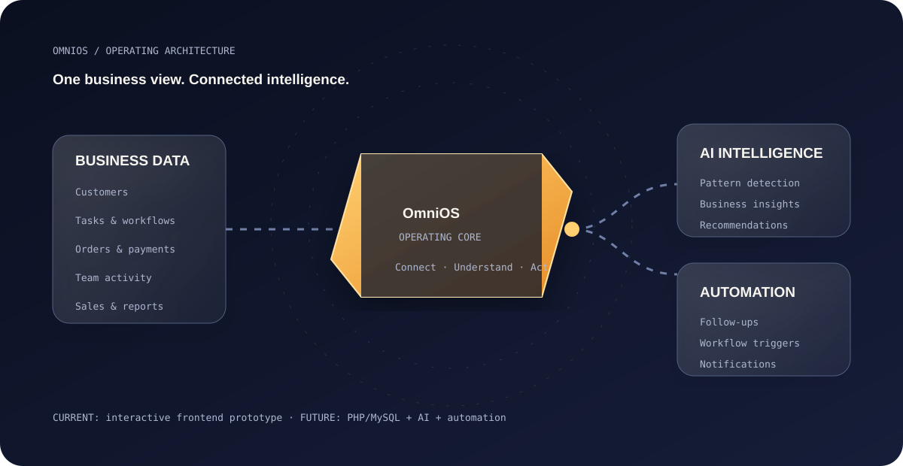

# OmniOS

<div align="center">

# **OmniOS**
### AI-Powered Business Operating System

**One workspace for business operations. One intelligence layer for what comes next.**

[🚀 Run Project](https://github.com/codebynv/OmniOS) · [📐 Architecture](assets/omnios-architecture.svg)

</div>

---

## ✦ What is OmniOS?

**OmniOS is a student-built concept for an AI-powered Business Operating System that brings essential business operations into one unified workspace.**

Instead of keeping customer information, tasks, orders, sales, team activity and reports across disconnected tools, OmniOS brings them together so a business can see what is happening from one place.

The long-term vision adds an intelligence layer that can **understand business data, surface useful signals, recommend actions and automate repetitive workflows.**

> **Current stage:** Interactive frontend prototype built with HTML5, CSS3 and Vanilla JavaScript.

---

## ◈ The Problem

Small businesses often have information scattered across:

`Customers` · `Tasks` · `Orders` · `Sales` · `Team` · `Reports`

That creates a visibility problem:

**Data exists → but the overall business picture is fragmented.**

OmniOS approaches this with a unified operational workspace rather than another isolated CRUD screen.

---

## ⚡ The OmniOS Idea

```text
 Customer Data ─┐
 Tasks ─────────┤
 Orders ────────┤
 Sales ─────────┼──→  OMNIOS  ──→  Unified Business View
 Team Activity ─┤                    │
 Reports ───────┘                    ↓
                              Intelligence Layer
                              ↓              ↓
                           Insights      Automation
```

### The product flow

**Collect → Centralize → Connect → Understand → Recommend → Automate**

---

## 🖥️ Current Frontend Prototype

The current prototype focuses on demonstrating the product experience and interaction model.

### Dashboard
- Business KPIs
- Weekly sales visualization
- Recent activity
- AI insight prototype panel
- Quick operations

### Customers
- Customer directory
- Search
- Status filtering
- Account information
- Spending overview

### Tasks
- Interactive Kanban board
- To Do / In Progress / Done
- Priority labels
- Assignees
- Drag-and-drop status changes
- Task detail modal

### Orders
- Order tracking
- Customer information
- Amounts
- Fulfillment status
- Payment method

### Team
- Team directory
- Roles
- Departments
- Availability
- Active task counts

### Sales & Analytics
- Revenue KPIs
- Monthly revenue visualization
- Acquisition channel breakdown
- Business performance indicators

### Notifications & Settings
- Pipeline notifications
- Unread state
- Mark-all-as-read interaction
- Profile/workspace settings
- Prototype automation toggles

---

## ✦ AI Layer — Product Vision

AI is not being presented as a fake backend feature in the current prototype. The interface demonstrates **where intelligence will fit into the product**.

Future intelligence can include:

- AI Business Assistant
- AI Meeting Summaries
- AI Email Writer
- AI Sales Assistant
- Lead scoring
- Predictive analytics
- Business forecasting
- Voice commands
- OCR document processing
- AI agents

### Example

```text
Sales changes
     ↓
OmniOS analyzes business context
     ↓
Important signal detected
     ↓
Insight / recommendation
     ↓
Optional workflow automation
```

---

## 🧠 Why OmniOS?

OmniOS is **not claiming that business-management software is new**.

Existing platforms such as Odoo, Zoho One, Microsoft Dynamics 365, Salesforce and HubSpot already provide powerful business capabilities.

The student-project positioning is different:

> **Existing enterprise solutions can be powerful and complex. OmniOS explores a simpler, unified, AI-first business workspace focused on essential operations, intelligent insights and automation.**

This makes the project technically interesting while keeping the claim realistic.

---

## 🧩 Architecture Visual



---

## 🛠️ Technology

### Current Review Build

| Technology | Purpose |
|---|---|
| HTML5 | Structure & semantic layout |
| CSS3 | Design, responsive layout, animation |
| Vanilla JavaScript | Interactions & dynamic prototype data |
| SVG | Lightweight visual assets |
| Git / GitHub | Version control |

### Planned Evolution

```text
HTML + CSS + JS
       ↓
React / TypeScript
       ↓
PHP + MySQL
       ↓
REST APIs
       ↓
AI + Automation
       ↓
Production Platform
```

The production stack is a roadmap, **not a claim about the current implementation**.

---

## 💰 College-Friendly / ₹0 Prototype

The current college prototype can be built and demonstrated with free/local tooling.

**No paid hosting, domain or AI API is mandatory for the prototype.**

Advanced AI APIs and cloud services can be introduced later if required.

---

## 🗺️ Roadmap

| Phase | Focus |
|---|---|
| **01** | Frontend prototype & UX |
| **02** | PHP backend + MySQL |
| **03** | REST APIs + authentication |
| **04** | AI assistant + intelligent insights |
| **05** | Workflow automation |
| **06** | Predictive analytics & AI agents |
| **07** | Production / SaaS evolution |

---

## 📁 Project Structure

```text
OmniOS/
├── index.html
├── omnios.html
├── style.css
├── script.js
├── assets/
│   └── omnios-architecture.svg
└── README.md
```

---

## ▶️ Run Locally

No build step is required for the current frontend prototype.

```bash
git clone https://github.com/codebynv/OmniOS.git
cd OmniOS
```

Then open **`omnios.html`** for the project explainer or **`index.html`** for the interactive dashboard.

For the best local experience, use VS Code + Live Server.

---

## 🎓 Academic Context

**Project:** OmniOS — AI-Powered Business Operating System  
**Domain:** AI-powered Business Management & Automation  
**Program:** B.Sc. Information Technology  
**Stage:** Frontend Prototype  
**Current Frontend:** HTML + CSS + JavaScript

---

## 👨‍💻 Author

**Nirav Vala**  
B.Sc. Information Technology

---

<div align="center">

### **OmniOS**
*Business operations, unified.*

</div>
